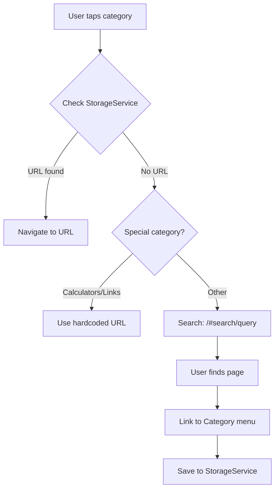

# Development Documentation

## For Future Agents / Developers

This document provides detailed technical information to help you understand and continue development of the MSHPrescribe mobile app.

## Current State (2025-12-04)

### ✅ Completed
- Core navigation structure (Bottom Navigation Bar)
- WebView integration with SSO support
- Bookmarks system with SQLite
- Native search functionality
- Self-healing URL strategy
- In-app site crawler
- Logout/cache clearing

### 🔄 In Progress
- First Android build (initial Gradle/NDK download)

### 📋 Pending
- iOS testing and deployment
- App Store / Play Store submission
- User acceptance testing with QH staff

## Technical Deep Dive

### URL Resolution Flow



### Database Schema

**bookmarks** table:
```sql
CREATE TABLE bookmarks(
  id INTEGER PRIMARY KEY AUTOINCREMENT,
  title TEXT,
  url TEXT,
  dateAdded TEXT
)
```

**category_links** table:
```sql
CREATE TABLE category_links(
  category TEXT PRIMARY KEY,
  url TEXT
)
```

### WebView Configuration

Critical settings in `webview_screen.dart`:
```dart
InAppWebViewSettings(
  sharedCookiesEnabled: true,  // SSO requirement
  javaScriptEnabled: true,     // Dynamic content
  cacheEnabled: true,          // Offline support
  cacheMode: CacheMode.LOAD_DEFAULT,
)
```

### Search URL Format

The website uses hash-based search:
```
https://mshprescribe.com/#search/[query]
```

NOT: `?s=query` (WordPress standard)

### External Link Handling

In `shouldOverrideUrlLoading`:
- **Allow**: mshprescribe.com, health.qld.gov.au, microsoftonline.com
- **External App**: qlam.com.au and other domains

## Common Tasks

### Adding a New Screen

1. Create file in `lib/screens/`
2. Import in `home_screen.dart` or navigation parent
3. Add route/navigation logic
4. Update `task.md` checklist

### Modifying Categories

Edit `AppConstants.guidelineCategories` in `constants.dart`:
```dart
static const List<String> guidelineCategories = [
  'New Category',  // Add here
  // ...
];
```

Then run the Site Crawler to discover URLs.

### Database Migrations

Currently no migration system. Changes to schema require:
1. Update table creation in `storage_service.dart`
2. Increment database version
3. Add migration logic in `onCreate`/`onUpgrade`

### Testing Offline Mode

1. Enable airplane mode on device
2. Navigate to previously visited pages
3. Verify cached content loads
4. Test bookmark access

## Debugging Tips

### WebView Issues

Add logging to `onLoadStart` and `onLoadStop`:
```dart
onLoadStart: (controller, url) {
  print('Loading: $url');
},
onLoadStop: (controller, url) {
  print('Loaded: $url');
},
```

### Database Issues

Query directly:
```dart
final db = await StorageService().database;
final result = await db.query('bookmarks');
print(result);
```

### Crawler Issues

The crawler uses JavaScript injection. To debug:
```dart
final result = await webViewController!.evaluateJavascript(source: '''
  console.log('Debugging...');
  return document.querySelectorAll('a').length;
''');
print('Link count: $result');
```

## Environment Setup Checklist

For a fresh development machine:

- [ ] Install Flutter SDK
- [ ] Install Android Studio
- [ ] Install Android SDK Command-line Tools
- [ ] Accept Android licenses (`flutter doctor --android-licenses`)
- [ ] Create Android emulator
- [ ] (Mac) Install Xcode and CocoaPods
- [ ] Run `flutter doctor` (should show all ✓)
- [ ] Run `flutter pub get`
- [ ] Run `flutter run` (expect 10-15 min first build)

## CI/CD Considerations

### GitHub Actions (Future)

```yaml
name: Build and Test
on: [push, pull_request]
jobs:
  build:
    runs-on: ubuntu-latest
    steps:
      - uses: actions/checkout@v3
      - uses: subosito/flutter-action@v2
      - run: flutter pub get
      - run: flutter analyze
      - run: flutter test
      - run: flutter build apk
```

### Play Store Deployment

1. Generate upload key
2. Configure `android/key.properties`
3. Update `android/app/build.gradle`
4. Build release: `flutter build appbundle`

## Architecture Decisions

### Why Hybrid (Not Fully Native)?

**Pros**:
- Content always up-to-date (no app updates needed)
- Minimal maintenance
- Leverages existing web infrastructure
- Fast development

**Cons**:
- Requires internet for most features
- Performance slightly lower than fully native

### Why Flutter (Not React Native)?

- Better performance
- Consistent UI across platforms
- Excellent WebView plugin (`flutter_inappwebview`)
- Strong typing with Dart

### Why Self-Healing URLs?

- Website structure may change
- Avoids breaking app with every URL change
- Search fallback ensures users always find content
- Crawler tool for quick fixes

## Security Notes

### SSO Implementation

- **Never** store passwords in the app
- Cookies are platform-managed (secure)
- Logout clears all cookies via `CookieManager`

### Data Storage

- SQLite database is unencrypted (contains only URLs/titles)
- No PHI (Protected Health Information) stored locally
- Bookmarks are non-sensitive

## Performance Optimization

### Current Status
- First build: ~10-15 minutes (NDK download)
- Subsequent builds: <1 minute
- Hot reload: <1 second

### Future Optimizations
- Pre-cache common pages on login
- Lazy load guideline lists
- Compress images in WebView
- Implement pagination for large lists

## Version History

### v1.0.0 (Current)
- Initial release
- Core features implemented
- Android support complete
- iOS pending testing

## Contact for Handoff

If you're a future agent/developer:
1. Read this document first
2. Review `walkthrough.md` for user-facing features
3. Check `task.md` for remaining tasks
4. Run `flutter doctor` to verify environment
5. Test the Site Crawler feature thoroughly

Good luck! 🚀
